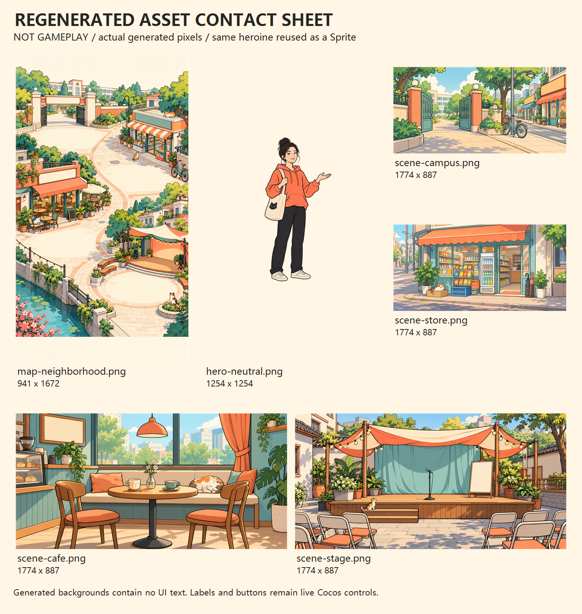

# 这题我来 · 生活漫画答题试玩

Cocos Creator **3.8.8** 的独立竖屏中文答题原型，版本 `0.2.0`。四站生活情境、67 道原创开发草稿，包含二／四选项、明确正误文字与图标、解析、暂停／继续、本地保存与失败站重整。题库尚未完成独立双人审核，本项目处于开发验证阶段。

当前状态、接手步骤与未验证项见 [中文交接说明](HANDOFF.md)。

## 打开项目

需要已安装的 Cocos Creator **3.8.8**。v0.1 构建验证使用 Windows、Node **24.13.0**、PowerShell **7.6.6**；v0.2 使用 macOS 和 Creator 内置 TypeScript **5.8.2** 验证代码与桌面预览；脚本不会自动安装软件、登录或下载 npm 依赖。

1. 克隆本仓库。
2. 在 Cocos Dashboard 导入 `project` 子目录，选择 Creator 3.8.8。
3. 打开 `assets/Main.scene`，使用编辑器预览。

仓库包含源码、六张最终 PNG、全部 Cocos `.meta`、场景与设置，不附带已生成的构建包或缓存。

## 测试、构建与本机访问

在仓库根目录打开 PowerShell，依次执行：

```powershell
node .\tools\test.cjs
.\tools\build.ps1 -Platform web-mobile
node .\tools\verify-art-import.cjs
node .\tools\http-smoke.cjs 7348
node .\tools\serve.cjs 7348
```

打开 **http://127.0.0.1:7348/**。服务只监听本机，Ctrl+C 停止。不要直接双击 `index.html`；Cocos 模块需要通过 HTTP 加载。若端口被占用，可改传另一端口；不同端口属于不同存档来源。

测试先创建本地 `evidence` 和 `.test-dist`，再由构建输出到 `project/build/web-mobile`。这些目录都不纳入 Git。Creator 成功构建退出码为 **36**；构建仍需可运行本机 Creator 的 GUI 环境。

默认安装根目录为 `C:\ProgramData\cocos\editors\Creator\3.8.8`。安装位置不同时：

```powershell
$env:COCOS_CREATOR_ROOT = 'D:\Cocos\Creator\3.8.8'
node .\tools\test.cjs
.\tools\build.ps1 -Platform web-mobile -CreatorExe 'D:\Cocos\Creator\3.8.8\CocosCreator.exe'
```

路径应指向已经安装的同一版本；示例路径不会触发安装。

两独立进程存档探针（先完成测试，使用不存在的新输出路径）：

```powershell
node .\tools\run-restart-probe.cjs write evidence\my-new-restart-probe.json
node .\tools\run-restart-probe.cjs read evidence\my-new-restart-probe.json
```

它验证注入式 Node 文件存储；浏览器关闭重开需另外实测。

macOS 本轮使用已安装的 Creator 3.8.8，测试命令：

```sh
COCOS_CREATOR_ROOT='/Applications/Cocos/Creator/3.8.8/CocosCreator.app/Contents' node tools/test.cjs
```

编辑器预览打开 [本机试玩](http://localhost:7457/)。必须导入 `project` 子目录；导入仓库根目录会得到空资源项目和灰屏。

## 玩法与保存

- 四站目标分别为 3／4／4／5 次正确；每站从容 3 格，错误或超时减 1，正确不回血。
- 选择答案立即提交；新题和解析各有 350 ms 防连点，重复／旧题／迟到提交拒绝重复结算。
- 正确基础分 100，连对附加 0／10／20，过幕 `200 + 50 × 剩余从容`；全对总分 3200。
- 同局一次免费换题和一次失败站重整；题 ID／事实簇不重复。中间站选择路线，前两道已结算题兑现路线承诺，互联网题不连续。
- 暂停收起题面并冻结时间；恢复题中存档或从后台返回后需要明确继续，不补算离线时间。
- 最近两局的已见事实簇参与抽题偏好；题池不足时分层放宽，路线、同局去重和重整保障仍成立。新局冻结偏好，恢复不会换掉当前题。
- 当前局存档按应用版本、规则和题包版本／摘要隔离；新版保留旧字节，从新旅程开始。近期历史单独双槽保存，保存失败可重试。摘要不是防作弊机制。

## 代码和素材

| 路径 | 内容 |
| --- | --- |
| `project/assets/scripts/core` | 可独立测试的题包、规则、状态与容量证书 |
| `project/assets/scripts/platform` | 可注入保存、生命周期与模拟激励广告接口 |
| `project/assets/scripts/ui` | 原生 Cocos UI、布局及生成图片加载 |
| `project/assets/scripts/QuizApp.ts` | 运行界面与流程 |
| `project/assets/resources/draft-bank.json` | 67 道原创 `draft` 题 |
| `project/assets/resources/art` | 透明主角、街区地图和四场景及必需元数据 |
| `art-source/asset-manifest.json` | 最终 PNG 尺寸、alpha、SHA-256 与预算记录 |
| `tests`、`tools` | 规则、模拟广告、保存、容量、资产检查及构建工具 |

六张图片为新生成的生活漫画资产。各章复用同一张透明主角 Sprite；题目、站点文字、锁／勾、按钮与正误反馈均为原生实时 UI。PNG 合计 **11,136,977 字节**，全部 RGBA8 估算 **37,760,080 字节**；实际移动端内存尚未测。

下图是**资产联系表，不是游戏运行截图**：



## 验证与范围

v0.2 使用实际 Creator TypeScript 5.8.2 和引擎类型检查。原 512 条最长运行路径保留，增加 256 条近期历史饱和路径。67 题均有难度和逐题编辑记录，仍为草稿，未完成独立人工双审。详见 [验证报告](TEST-REPORT.md)、[题目审校](docs/V02-QUESTION-REVIEW.md)、[容量证明](CAPACITY-PROOF.md) 和 [修订记录](REVISION-NOTES.md)。

v0.1 的官方 Web 构建及六张 PNG 导入验证记录保留；v0.2 的代码与引擎类型已通过 macOS 本机检查，桌面编辑器预览已完成四站通关、换题、失败重整、回顾、再次开局与关闭标签重开恢复；未重新执行 Windows Web 发布构建。手机安全区、性能及微信目标仍需后续验证。当前 UI 不调用广告，本次没有公开部署。
